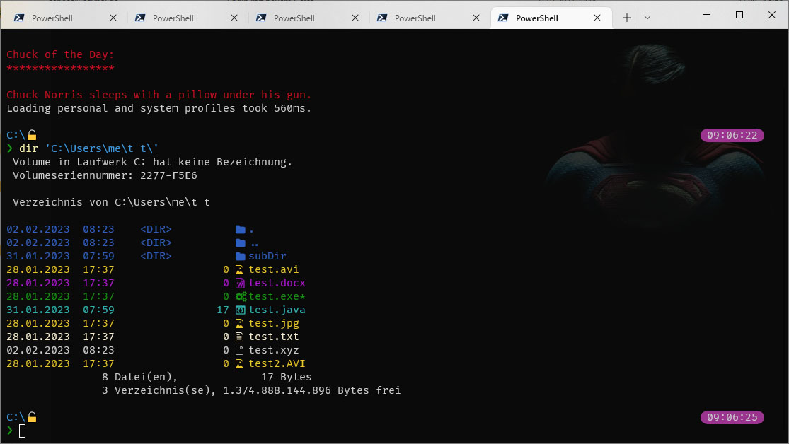

# colorDir
Use format and functionality of the old 'dir' command from cmd.exe in powershell and add content based colors

After long years running lots of stuff on cmd.exe I finally felt the need for a change because I saw the Tab-based auto-complete of other shells. Cmd offered some comfort here, too but could not match the others because it wouldn't add the trailing '\\' after completion and would only accept the backslash, which is awkward to enter on a german keyboard.

I tried MinGW and other unix-like shells but in the end they all had various drawbacks or the philosophy and/or output of tools etc. was not to my liking. So Powershell it was!

PS gave me the sought-after auto-complete with trailing delimiter and support for slash instead of backslash. It felt pretty cool, it was modern... perfect... NOT!

Although Cmd is a pretty limited shell and it violates all the unix philosophies (one task - one tool etc.) it offers one command that is most important to me: 'dir'.

Dir is kind of a swiss army knife for file systems and combines functionality that is split into various tools on other plattforms. It shows directory contents, directory sizes, lets you search for files based on (some kind of) regular expressions and so on. In the end I could not cope with the powershell variants of 'dir', 'ls', 'll', 'Get-ChildItem' etc. The output format was wrong, they wouldn't give me added up sizes, I could not find files traversing subDirs easily, I was not satisfied.

AND: I wanted to have colorized output, like ls in bash or others. Two problems, that really bugged me.

## Getting back functionality and formatting of 'dir'

My first solution to getting 'dir' back was writing a wrapper in C# that started "cmd.exe", caught the output and spit it to the PS console. Easily done and a nice start to get to know C# a bit. Together with an alias in $profile it worked well and gave me the comfortable feeling of being at home with my shell again.

## Bring up the colors

Result of calling 'cmd /c "dir"' from a C# app was basically a list/array of strings, one for each line 'dir' gave me back.

Next step then was analysing that lines and using 'Write-Host' with the '-ForegroundColor' parameter to give me the sought after colors

## Switching to native Powershell

On some machines my solution was not optimal, since startup of the C# tool took a noticable amount of time, so I started playing with powershell scripting. Using Windows Terminal and Powershell core gave me the ability to use 24bit colors using ANSI escapes. After solving some problems when passing command line arguments (like '/s') into cmd.exe everything was running smoothly... but

## Feeling the drag

Since the result of the 'dir' call is available only after cmd.exe finishes, I got a noticeable delay when doing something like 'dir *.java /s' within a deeply nested directory structure.

Solution was to display some kind of 'spinner' while cmd is doing its magic => off into multi-threading land.

Basically what I'm doing now is
- fetch parameters given via the 'dir' alias
- handle special characters/options, eg '/s', '/b', '/' and decorate some others with double double quotes
- build the sequence to call 'cmd' with all necessary parameters
- Start-ThreadJob with given sequence
- wait for a few milisecs to give the thread the oportunity to finisch quick jobs
- if thread ist still running enter a loop and display the spinner frames
- as soon as thread has finished clear the spinner animation
- Receive-Job results and clean up thread

	
